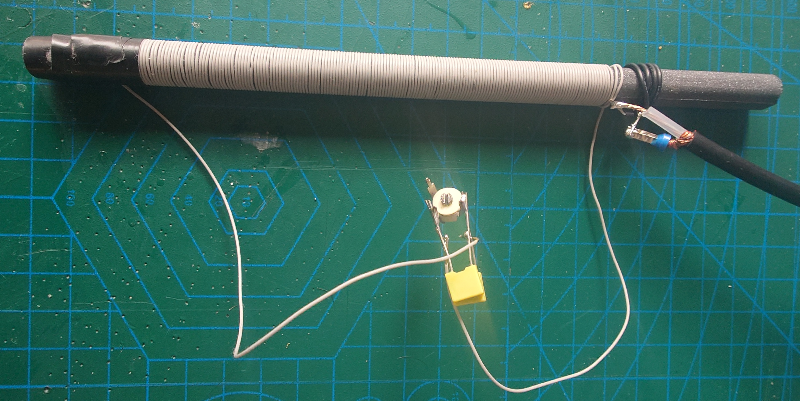
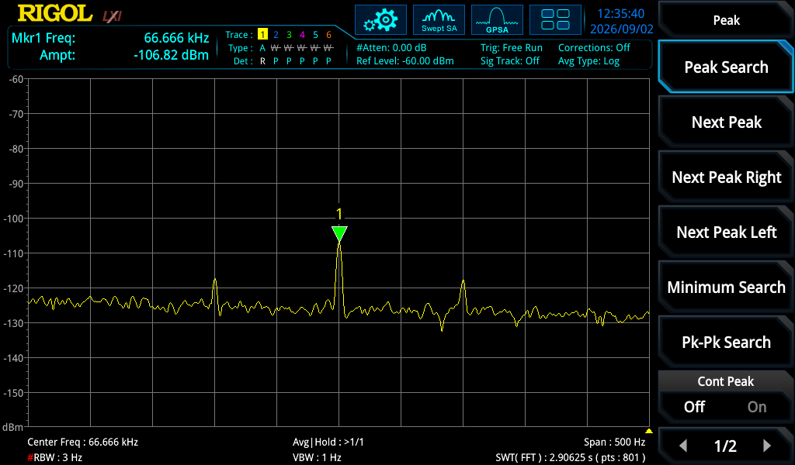
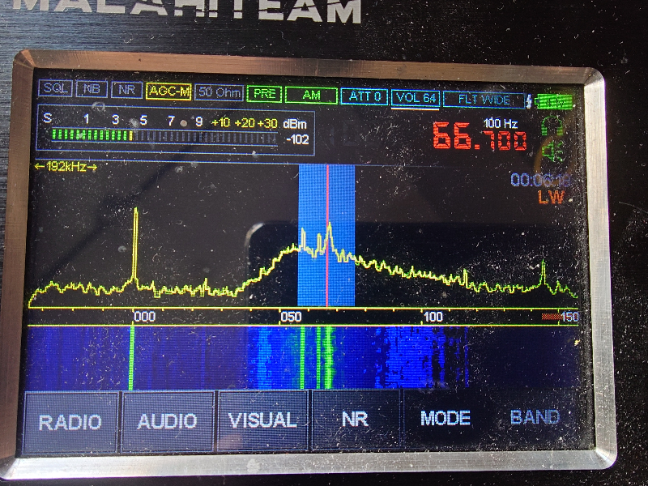
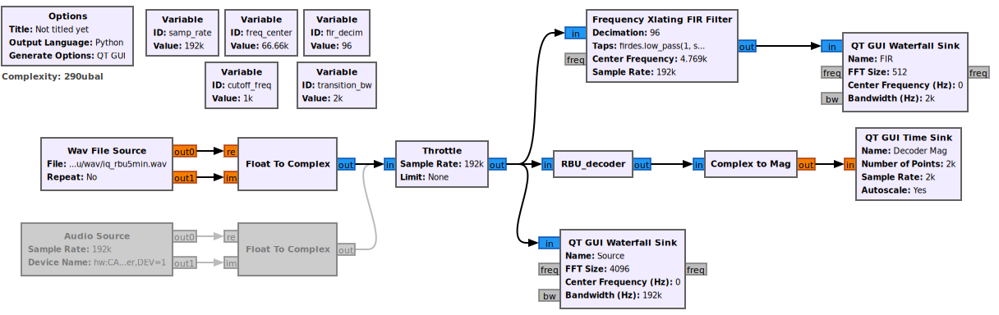
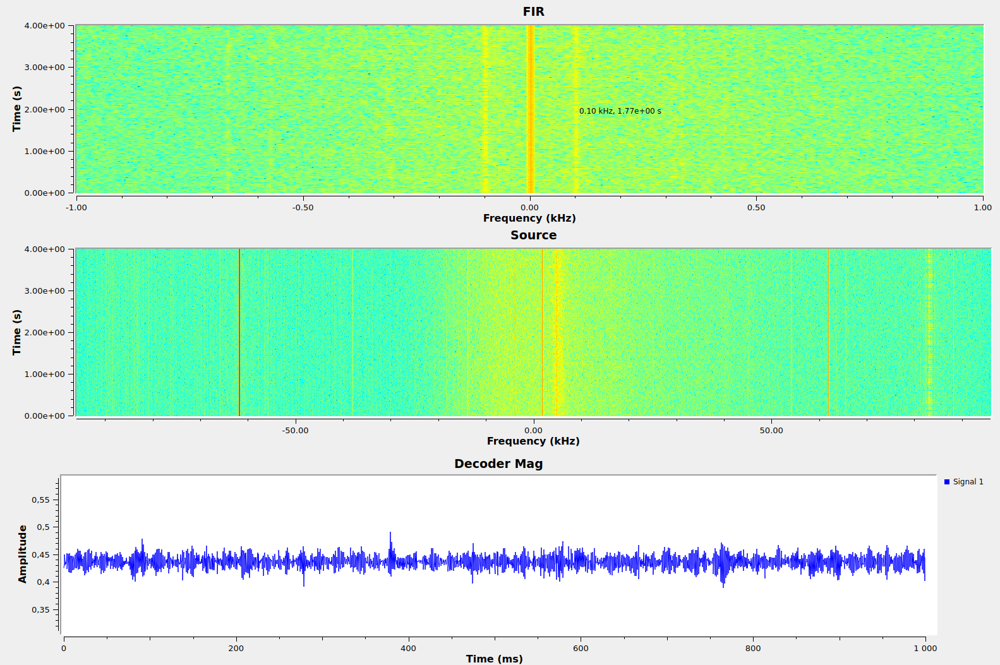
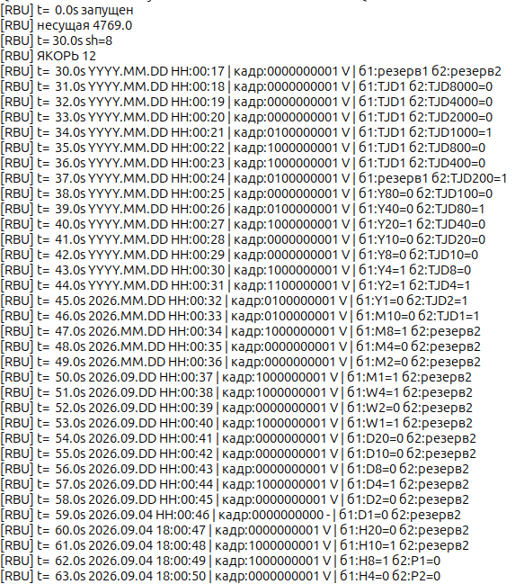

# Приём и декодирование сигналов РБУ на Малахит DSP3 в городских условиях
- [Приём и декодирование сигналов РБУ на Малахит DSP3 в городских условиях](#приём-и-декодирование-сигналов-рбу-на-малахит-dsp3-в-городских-условиях)
  - [Задача](#задача)
  - [Что такое РБУ](#что-такое-рбу)
  - [Оборудование](#оборудование)
  - [Структура репозитория](#структура-репозитория)
  - [Быстрый старт](#быстрый-старт)
  - [Как это работает (кратко)](#как-это-работает-кратко)
  - [Результаты](#результаты)
  - [Сложности, с чем пришлось столкнуться](#сложности-с-чем-пришлось-столкнуться)
  - [TODO / планы](#todo--планы)
  - [Список литературы](#список-литературы)


## Задача

Проверить, можно ли в Москве (плотная застройка, радиошумы) принимать и декодировать сигналы станции точного времени [РБУ (66,666 кГц)](https://ru.wikipedia.org/wiki/RBU), используя SDR-приёмник Малахит DSP3 и самодельную ферритовую антенну, с минимальными аппаратными доработками.

Параллельно решаемая задача: отработка навыков взаимодействия с ИИ (продолжение, общие выводы по LLM тут [AIS приемник на базе AX5043]( https://github.com/wla-da/ais_ax5043)).

<details>
<summary>Смотреть выводы (спойлер)</summary>
Да, можно принять и декодировать сигнал РБУ в Москве на ферритовую антенну и приемник Малахит DSP3. Дата, день недели, час и минута восстанавливаются из эфира полностью (см. раздел «Результаты»).
</details>


## Что такое РБУ

[РБУ](https://ru.wikipedia.org/wiki/RBU) — российская станция эталонной частоты и точного времени, работает на 66,666 кГц, передатчик находится в Подмосковье, мощность 10 или 50 кВт (источники дают разную информацию). Помимо эталонной несущей, она непрерывно передаёт цифровой код текущего времени (дата, день недели, час, минута без секунд), который можно принять и декодировать даже на простой приёмник на боковых частотах ±100 и ±312,5 Гц. Протокол простой и описан.


## Оборудование

* **Приёмник:** Малахит DSP3. Режим AM, преамп +20 дБ, шаг 100 Гц, полоса захвата IQ сигнала 192 кГц, частота по шкале 66,700 кГц (см. Рис. 3).
* **Антенна:** самодельная ферритовая (см. Рис. 1). Стержень — китайский феррит с Ozon, 200×10 мм. Катушка намотана обычным многожильным проводом ~0,75 мм по изоляции (литцендрата/ПЭВ под рукой не было), длина намотки ~130 мм, намотал сколько было около 5,5 метров. Индуктивность такой катушки ≈ 1,83 мГн, резонансная ёмкость на 66,666 кГц ≈ 3,1 нФ. Катушка связи — 3-4 витка монтажного провода. Настройка в резонанс — подстроечным конденсатором по спектроанализатору RSA3015N и генератору с перестраиваемой частотой 60-70 кГц.




Рис. 1. Самодельная ферритовая антенна на 66,6 кГц


## Структура репозитория

```
.
├── img/                    — иллюстрации к этому README
├── src/
│   ├── offline_rbu.py      — офлайн-декодер: читает wav, декодирует и выводит дату/время
│   ├── rbu_demod.grc       — «живой» декодер в GNU Radio Companion
│   ├── rbu_epy_block_0.py  — embedded-блок декодера для GRC
│   └── rbu.py              — сгенерированный GRC поток
├── wav/
│   ├── iq_rbu5min.wav      — 5-минутная IQ-запись с Малахита
│   ├── mono_rbu.wav        — монофоническая запись РБУ из интернета
│   └── mono_rbu2.wav       — ещё одна моно-запись из интернета
├── LICENSE
└── README.md
```

## Быстрый старт

**Требования:** Ubuntu 24.04 LTS, GNU Radio 3.10.9.2, Python 3.12.3,
`numpy`, `scipy`. Для анализа и написания кода можно и нужно использовать LLM, автор использовал Qwen 3.8 (основная работа), ChatGPT и Deepseek как вспомогательные.

**Запись IQ с Малахита** — см. отдельную заметку [«Запись IQ сигнала с приёмника Малахит DSP3»](https://github.com/wla-da/ais_lab_tools/blob/main/rec/README.md) (и `arecord` в ней).
Далее в примерах используется `wav/iq_rbu5min.wav`.

**Офлайн-декодирование:**
```bash
python3 src/offline_rbu.py
```
Скрипт сам находит несущую, синхронизируется и печатает дату/время.


**Живой декодер в GRC:** открыть `src/rbu_demod.grc` (схема — Рис. 4),
запустить; в консоль будет тикать текущее время, а на водопадах/осциллографе
видно несущую, боковые и огибающую (Рис. 5).


## Как это работает (кратко)

Сигнал РБУ — несущая 66,666 кГц, фазоманипулированная поднесущими **100 Гц**
(бит «0») и **312,5 Гц** (бит «1»). Элемент длится 100 мс (с 5-мс провалом в
конце), 10 элементов (бит) = секунда, 60 секунд = минута. В каждой секунде два
информационных бита (элементы 0 и 1); элементы 2–6 — всегда «0», элемент 9 —
всегда «1», элементы 7–8 — минутные маркеры. Поля (год, месяц, день недели,
день, час, минута) разложены по битам с привязкой к конкретной секунде минуты, плюс есть контроль чётности **P1–P8**. Описание протокола подробнее см [РБУ Структура сигнала](https://ru.wikipedia.org/wiki/RBU#Структура_сигнала).

Алгоритм декодера:
1. Поиск несущей по пику спектра и перенос её в ноль.
2. Прореживание до 2000 Гц.
3. В каждом 100-мс элементе — сравнение мощности на ±100 и ±312,5 Гц → бит.
4. Группировка по 10 элементов, подбор циклического сдвига по фиксированным
   нулям и маркеру.
5. Якорь — старт минуты (сек.00 = «11»).
6. Голосование по повторениям секунд + чётности P4–P8 для исправления ошибок.
7. Вывод `ГГГГ.ММ.ДД ЧЧ:ММ:СС`.

## Результаты

Принятый на Малахит спектр РБУ с анализатора RSA3015N (см Рис. 2): несущая 66,666 кГц (−106,8 дБм) и боковые ±100 Гц.  




Рис. 2. Спектр РБУ на RSA3015N: несущая и боковые ±100 Гц

Спектр РБУ на экране Малахита (см Рис. 3) различим слабо из-за сильных помех рядом по частоте и широкой полосе обзора: на фото полоса 192 кГц, но и при полосе 48 кГц тоже различимо слабо.




Рис. 3. Экран Малахита: несущая РБУ и помехи рядом

"Живой" декодер в GRC (Рис. 4, 5, 6) уверенно восстанавливает `04.09.2026`, день недели и минуты.




Рис. 4. Пайплайн живого декодера в GRC




Рис. 5. Выходы GRC: водопады и огибающая




Рис. 6. Лог живого декодера: тик времени и биты


## Сложности, с чем пришлось столкнуться

* **Сильная помеха рядом (~67 кГц)** — местами сравнима с полезным сигналом,
  поднимает шумовой пол в полосе декодирования.
* **Слабая боковая ±312,5 Гц** в городском шуме — «единицы» читаются хуже
  «нулей»; выручают голосование и чётности.
* **Расхождение шкалы Малахита**: реальная несущая в IQ оказывается со
  смещением ~+4,77 кГц от номинала — декодер ищет её сам.
* **Узкий резонанс феррита**: без точной настройки в резонанс боковые
  «съедаются» скатами АЧХ антенны.
* **Хрупкая синхронизация в live**: однократный захват несущей/якоря ломается
  при уходе частоты — нужна периодическая пересинхронизация (см. TODO).


## TODO / планы

* Периодический поиск несущей в окне ±20 кГц и автосопровождение; автоматическая  ресинхронизация (сброс якоря) при падении счёта кадра.
* Декодирование меток DUT1/dUT1 и TJD; использование P1–P3 для коррекции.
* Перекрёстные проверки: день недели из календаря vs декодированный, инкремент минуты, постоянство TJD, one-hot DUT1.
* Улучшение SNR/BER: когерентное детектирование, мягкие решения + ML по   чётностям, notch-фильтр помехи ~67 кГц.
* Активный согласующий усилитель на полевом транзисторе с прямым подключением к антенной катушке.
* Обработка IQ на **ESP32** с OLED-дисплеем: ESP32 подключается по USB к Малахиту и показывает дату/время на экране.
* Антенна: литцендрат, демпфирование добротности для полосы ±400 Гц.

## Список литературы

1. https://ru.wikipedia.org/wiki/RBU — описание протокола РБУ.
2. https://www.qrz.ru/schemes/contribute/constr/radio66/ — «Экспериментальный
   приёмник сигналов РБУ 66 кГц».
3. https://forum.cxem.net/topic/282160-приёмник-rbu-6667/ — «Приёмник RBU 66,67».
4. https://github.com/wla-da/ais_lab_tools/blob/main/rec/README.md — «Запись IQ
   сигнала с приёмника Малахит DSP3».
5. https://github.com/wla-da/ais_lab_tools/blob/main/demod/README.md —
   «Извлечение AIS пакета из IQ сигнала в GRC на базе стандартных блоков», как пример обработки IQ сигнала в GRC.